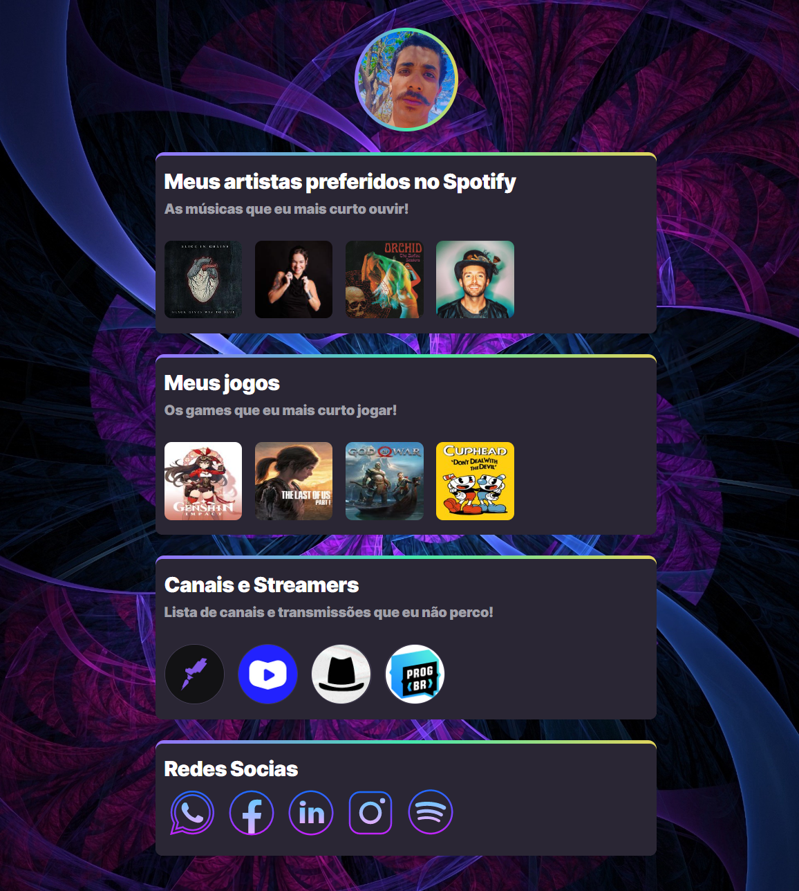

# NLW eSports
 
>Trilha Explorer 

Projeto construído com alguns aprendizados novos adquiridos na Next Level Week da Rocketseat.

[🔗Acesse o projeto aqui](https://RDG-Preto.github.io/nlw-rocketseat/)

##🛠️ Tecnologias

-HTML
-CSS
-Git e Github

## Aprendizados novos na NLW:

- Usar o :hover no CSS
- transform no CSS
- transition no CSS
- Commits no Github
- Subir repositórios no Github direto do Visual Studio Code

## ✉️Contato 

rodrigo.alves1109@hotmail.com
